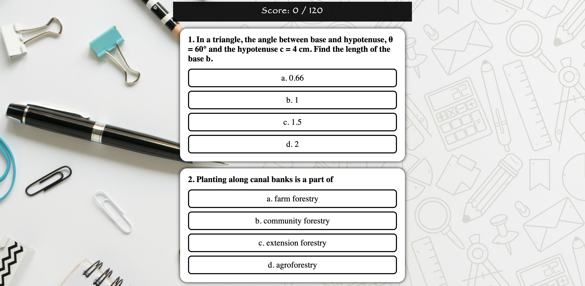

# 
<h1 align="center">
  SmartPrep MCQ Practice App<br/>
  <a href="https://smartprep.vercel.app" target="_blank">smartprep.vercel.app</a>
</h1>
<div align="center">
  
</div>

## Overview
The SmartPrep MCQ Practice App is designed to help students prepare for their exams. This web-based platform provides a self-assessment test of multiple-choice questions (MCQs), allowing students to practice and assess their knowledge effectively.

<!--### [Live Demo here](https://smartprep.vercel.app)-->


## Features
- **Customizable Question Bank**: Easy access to add/delete your MCQ's.
- **Live Score**: Check your score instantly.
- **Instant Feedback**: Get immediate feedback on your answers with detailed explanations.
- **User-Friendly Interface**: Enjoy a clean and intuitive interface for a seamless learning experience.


## Creating Backend Server (<a href="https://smartprep.vercel.app/admin" target="_blank">smartprep.vercel.app/admin</a>)
1. Create a Supabase Project.
2. Run the following SQL script to create a table in Supabase:
   ``` sql
   CREATE TABLE questions (
     id SERIAL PRIMARY KEY,
     question TEXT,
     a TEXT,
     b TEXT,
     c TEXT,
     d TEXT,
     answer CHAR(1)
   );
3. Copy your Supabase URL and API key into your code.
4. Install the required python requirements:
   ``` python
   pip install -r /path/to/requirements.txt
5. Run the Server:
   ``` python
   python app.py
6. You can add your questions from this page.

### Alternatively you can add questions using insertQuestions.js file. For this follow the below steps:
1. Make sure to create the Supabase project table as mentioned above.
2. Add your questions to questions.json in below formmat:
   ``` json
   [
     {
       "question": "Tropical moist forests do not include",
       "a": "broadleaved forests",
       "b": "wet evergreen forests",
       "c": "semi-evergreen forests",
       "d": "moist deciduous forests",
       "answer": "a"
     },
     {
       "question": "Another question",
       "a": "option 1",
       "b": "option 2",
       "c": "option 3",
       "d": "option 4",
       "answer": "b"
     }
     // Add all your questions here
   ]
3. Add your Supabase credentials to insertQuestions.js file.
4. Run the insertQuestions.js file using:
   ``` node
   node insertQuestions.js 
## Installation
To run the app locally, follow these steps:

1. **Clone the repository:**
   ```bash
   git clone https://github.com/VarunMusham/SmartPrep.git
2. **Navigate to the project directory:**
   ```bash
   cd SmartPrep
3. **Install dependencies:**
   ```bash
   npm install
4. **Start the development server:**
   ```bash
   npm start

## Usage
1. Open your web browser and navigate to http://localhost:3000.
2. Select the course you want to practice.
3. Choose a set of questions and start practicing.
4. Review your answers and check the detailed explanations for each question.


## Contributing
You are welcome to contribute for enhancing the app. To contribute, please follow these steps:

1. Fork the repository.
2. Create a new branch:
   ```bash
   git checkout -b feature/your-feature-name
3. Make your changes and commit them:
   ```bash
   git commit -m "Add your message here"
4. Push to the branch:
   ```bash
   git commit -m "Add your message here"
5. Create a Pull Request detailing your changes.

<br>
Feel free to modify the sections as per your specific project details and requirements
<br>
<a href="https://wildlife-geography.vercel.app" target="_blank">Final Demo</a>
